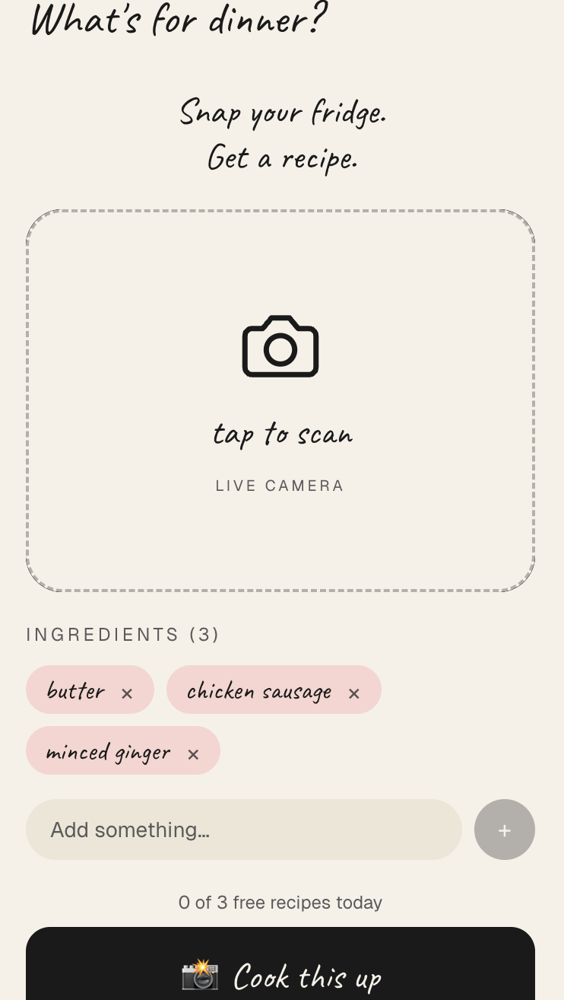
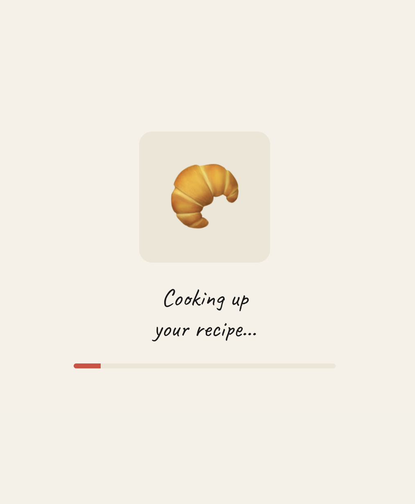
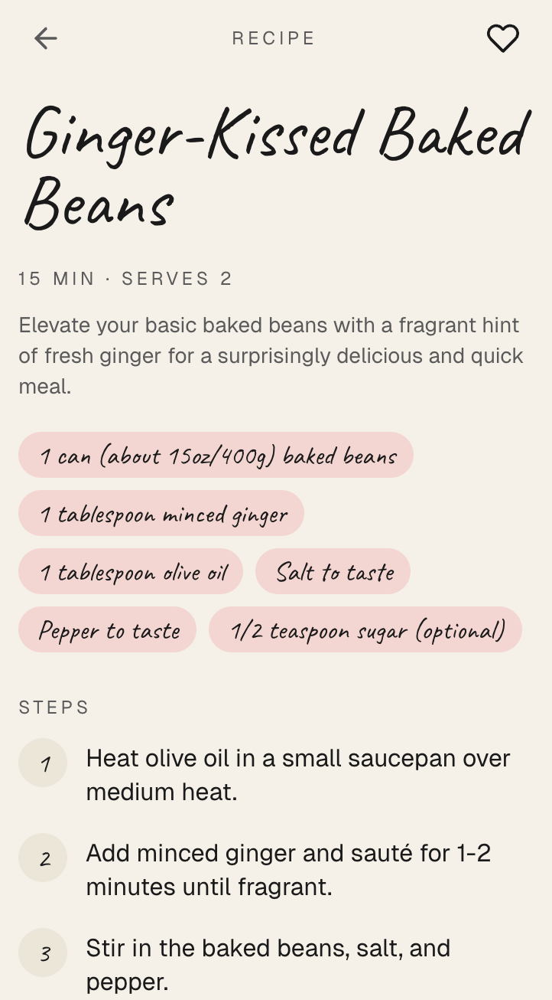

# What's for Dinner

Scans leftover items in your fridge and generates recipes from what's actually there.

| 01 · snap | 02 · cook | 03 · eat |
| :---: | :---: | :---: |
|  |  |  |

## The Idea

Open the fridge. Stare. Close the fridge. Order takeout. Repeat.

What's for Dinner kills decision fatigue at the worst time of day. Snap a photo of your fridge or pantry, and Gemini's vision model identifies what you have and proposes a recipe you can actually cook tonight. No meal-prep apps, no shopping lists — just the food in front of you, turned into a plan in under ten seconds.

## How It Works

```
┌─────────────┐    ┌─────────────┐    ┌─────────────┐
│   PHOTO     │───▶│   GEMINI    │───▶│   RECIPE    │
│  (fridge,   │    │   (vision   │    │  (steps,    │
│   pantry)   │    │   + flash)  │    │   timing)   │
└─────────────┘    └─────────────┘    └─────────────┘
```

1. **Capture** — user uploads or pastes a photo of their fridge.
2. **Detect** — Gemini vision identifies ingredients with rough quantities.
3. **Generate** — a server action prompts Gemini Flash for a single recipe using only what's visible.
4. **Render** — recipe streams back into the UI with steps, timing, and serving size.

## Stack

| Layer    | Tool                                            |
| -------- | ----------------------------------------------- |
| Frontend | Next.js 16 · App Router · React 19              |
| Styling  | Tailwind CSS v4                                 |
| AI       | Gemini 1.5 Flash (`@google/generative-ai`)      |
| Hosting  | Vercel                                          |

## Run Locally

```bash
git clone https://github.com/khalifbuildsai/whats-for-dinner
cd whats-for-dinner
npm install
echo "GEMINI_API_KEY=your_key_here" > .env.local
npm run dev
```
